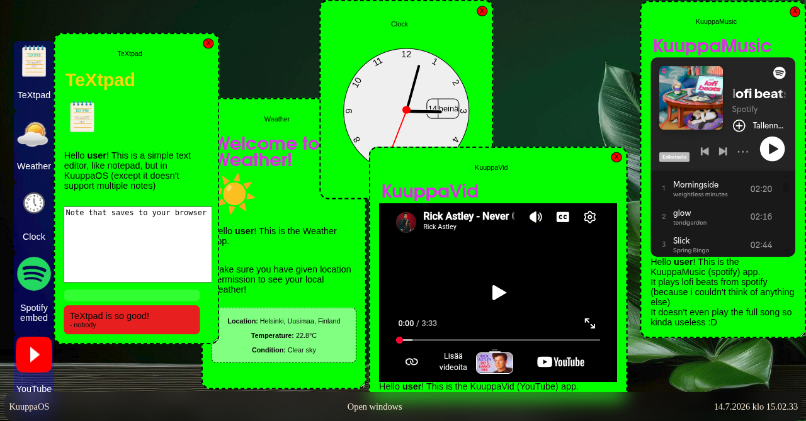

# KuuppaOS

## Random info
A WebOS made for Stardance event  
I made it for fun, but also to learn HTML, CSS and JS.
Made in GitHub Codespaces and VSCode with HTML, CSS and JS.  
Images made with online resources and Pixlr Express.  
Resources I used: WebOS 1 Jam(Hack Club), online resources(for some apps and help with some stuff) and help from AI (for some javascript).  
Also first commits are meaningless, because I didn't have Live Server installed in my Codespace so I had to test with GitHub Pages.  

## Functionality
Taskbar has a **working clock that opens calendar**, a **start menu** (use that to open the **customization menu**), **weather** that also opens weather. **Open and minimzed apps** also show in the taskbar!  
You can drag, resize (from the bottom right corner), close, minimize and maximize (fullscreen) all the apps!  

### 17 apps:  
TeXtpad: Export your text as .txt, .md, .html and .csv and it also saves locally to your browser.  
Clock: Just a basic analog clock.  
KuuppaVid: Plays any YouTube video (or playlist) you want. Just type in the name.  
KuuppaMusic: Listen to XFM's (xfm.ee) live radio stream :D  
HackCMD: Pretend like you're hacking.  
Paint: Paint anything, you can change the color and size. After you are done, you can export it as .png  
KuuppaBrowser: Browse all websites (that allow being in an iframe)!  
Calculator: Do simple math calculations.  
Pong: Play pong against an AI.  
Camera: Take photos and use filters.  
Ghost game: Play a Pac-Man like (self-made) ghost hunting game!  
Recorder: Record audio from your microphone.  
Dog gallery: View cute photos of (mostly)my dogs.  
KuuppaAI: Chat with the kuuppaest chatbot ever.  
About: Info about the apps in KuuppaOS.  
Terminal: Run commands. There are 12 different commands!  
App store: Install all those apps.  

###Start menu:  
A shutdown button  
A reboot button  
A button to open welcome screen  
A customization (settings) menu button  
Now playing with a stop button  

### Customization/settings menu:  
Custom wallpaper  
App blur
App transparency  
App background color  
Toggle RGB mode  
Save to local storage button  
Reset to defaults button  

### Calendar and Weather:  
Weather only shows if you have location allowed. (also if it doesn't work with Helium browser it's not my fault)  
Weather shows you the **current condition (text and emoji)**, **your location** and **temperature**, in the taskbar it only shows the temperature and the emoji.  
Calendar has the current day marked.

### Other functionality:
A **rubber-band selector**, you might not know what it means, but you have used it. It's the funny blue square that comes up when you click and drag on empty space on your desktop.  
Many **animations**  
A **custom scrollbar**  
KuuppaMusic **now playing** shows **in taskbar** when **minimized**  
A **loading screen**  
Installed apps **save to local storage**!  

Original KuuppaOS:

Also, please install KuuppaAI and type "secret word" and press send and include the secret word in your rating. That's how I know that you actually read this. Thanks!